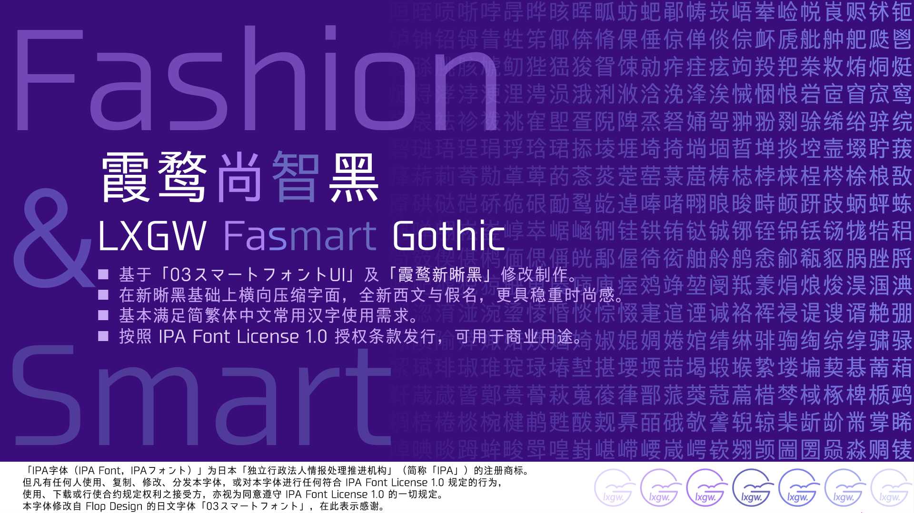
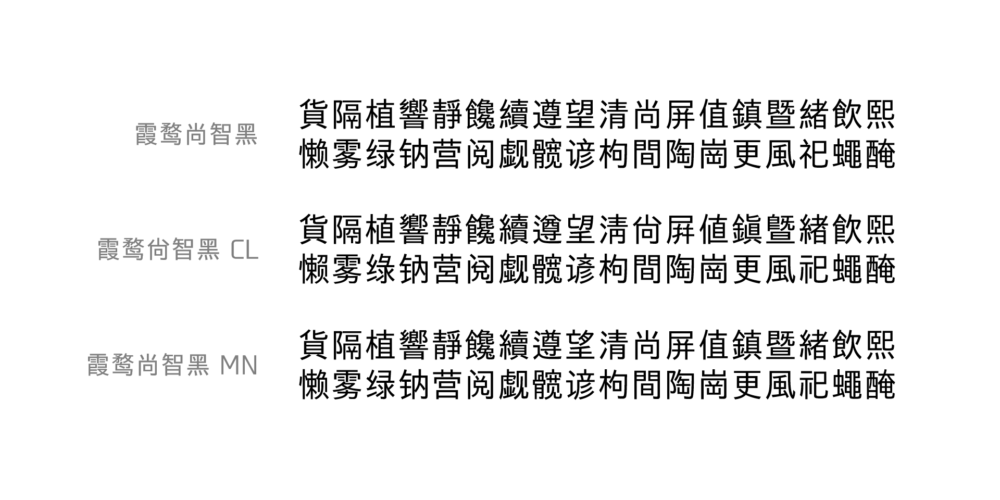

> 本项目不再更新维护。

# 霞鹜尚智黑 / LXGW Fasmart Gothic
基于[「03スマートフォントUI」](https://www.flopdesign.com/freefont/smartfont.html)以及[「霞鹜新晰黑」](https://github.com/lxgw/LxgwNeoXiHei)[「霞鹜晰黑 CL/MN」](https://github.com/lxgw/LxgwXiHei)衍生的中文黑体字型。

将字面横向压缩 94%，全新英数与假名，更具稳重时尚感。

> [!NOTE]
> - 本字体项目现已单独设立 repo，不再随附于《霞鹜新晰黑》，并且不再与新晰黑同步新增或调整字符。
> - 本字体嵌入用途受限，请参阅下方「授权信息」，尤其是原字体制作方声明。

## 概览

## 不同字形版本及收字情况
- **霞鹜尚智黑：** 采用中国大陆规范字形（GB 字形）。收录的汉字部分与 [霞鹜新晰黑 v1.124](https://github.com/lxgw/LxgwNeoXiHei/releases/tag/v1.124) 看齐。
- **霞鹜尚智黑 CL：** 参考早期铅字印刷字形常见写法，回归旧式印刷字形，合并一部分「源规格分离」原则下分化的异码字。收录的汉字部分与 [霞鹜晰黑 CL v0.321](https://github.com/lxgw/LxgwXiHei/releases/tag/v0.321) 看齐。
- **霞鹜尚智黑 MN：** 采用兼顾当代惯用部件写法的折中印刷字形（非楷化字形），严格遵循「源规格分离」原则。收录的汉字部分与 [霞鹜晰黑 MN v0.321](https://github.com/lxgw/LxgwXiHei/releases/tag/v0.321) 看齐。
- 尚智黑所收的符号相比于新晰黑会有所欠缺。

## 获取字体
- 进入 [Releases](https://github.com/lxgw/LxgwFasmartGothic/releases) 页面下载 TTF 格式字体文件。Release 版本号与 GB 字形的「霞鹜尚智黑」（新晰黑）相同。
- 也可进入 [猫啃网](https://www.maoken.com/freefonts/10610.html) 或 [字加](https://www.zijia.com.cn/6531.html) 获取。
- 可在 [蓝奏云（密码:2q5d）](https://lxgw.lanzouv.com/b02seu58yd) 或 [永硕网盘](http://lxgw.ysepan.com/) 下载。

> ㊟ 不保证与（新）晰黑项目同步更新。
## 授权信息
- 本字体在 IPA 所开发并发布的[「IPAexゴシック」](https://moji.or.jp/ipafont)、[「03スマートフォントUI」](https://www.flopdesign.com/freefont/smartfont.html) 基础上衍生，依照 [IPA 开放字体授权条款 1.0 版（IPA Font License 1.0）](https://opensource.org/licenses/IPA/) 授权。
- 您可以将本字体用于印刷品、数字文档、影视内容、海报广告、包装、出版物设计以及其他各种设计用途，包括商业和非商业用途；  
  也可在本字体基础上继续改作衍生，惟衍生字体名称（包括程序名、文件名、字体名）不得包含「IPA」字样，且衍生字体须继承相同授权许可（故 IPA 字体授权许可与 SIL OFL 不兼容）。
- 根据 IPA Font License 1.0 有关条款，在没有邮费、存储媒介费用和手续费的情况下，须免费提供字体文件，不得将字体文件单独售卖。
- 如果您要将本字体替换回 IPA 原始授权字体，请从 [IPA 字体下载页面](https://moji.or.jp/ipafont/ipafontdownload)获取原始授权字体「IPAexゴシック」。  
  对于涉及字体文件再分发的嵌入式应用（如应用程序、硬件设备、网页等嵌入），[请点击此处](https://github.com/lxgw/LxgwNeoXiHei/blob/main/documentation/embedding_instructions.md)（跳转到「霞鹜新晰黑」repo）。
> [!Note]
> **原字体「03スマートフォントUI」制作方 FLOP DESIGN 声明如下**（原文 + 译文）：[^1]
> > 作成した印刷物およびデジタルコンテンツ・ソフトウェアにつき、その商用・非商用・フリーウェアに関わらず放送、通信、各種記録メディアなどの媒体の形式も問わず、自由に使用をする事が可能です。ただし、これはIPAフォントのライセンスの元にあり、IPAのページのIPAフォントライセンスをご覧下さい。特にフォントを改変し再配布する場合、プログラムにエンベッド（埋め込み）をする場合、オンラインサーバー上に置く場合、ウェブフォントとしてサーバー上にアップロードする場合に制限事項があるので必ず良くお読み下さい。また「ひらがな」「カタカナ」のデザインの著作権はフロップデザインに帰属し、有償での公開・販売・再配布・抽出が可能なプログラムへの埋め込みを禁止しています。
> 
> 您可以自由在您创建的印刷材料和数字内容软件中使用该字体，无论其为商业、非商业或免费软件；也可以在任何形式的媒体中使用，包括广播、通信和各种记录媒体。不过，使用过程中须遵守 IPA 字体许可，请参阅 IPA 页面上的 IPA 字体许可，尤其是在修改和再分发字体、将字体嵌入到程序中、将字体放置于在线服务器上以及将字体作为 webfont 上传到服务器等方面都有一定限制，因此请仔细阅读。此外，平假名和片假名设计的版权归 FLOP DESIGN 所有，禁止将其嵌入到有偿公开、出售、再分发或提取的程序中。
> 
> > アプリ・ゲームに内蔵する場合、プログラムにエンベッド（埋め込み）をする場合、ウェブフォントとしてサーバー上にアップロードする場合にはご利用頂けません。その際はメールにてご連絡頂くか「日本語ウェブフォントキット」を http://www.flopdesign.com/shop/webfont.html にてご購入下さい。フォント自体の完成度も高い仕上がりになっています。※安心して使えるIPAより分離したライセンスです。
> 
> 不得用于 APP 或游戏内置、程序嵌入或者作为 webfont 上传到服务器。在这种情况下请与 FLOP DESIGN 电邮联系，或者通过 http://www.flopdesign.com/shop/webfont.html 购买「日文 Webfont 套件」，字体本身的完成度也很高。＊采用与 IPA 分离的授权许可，可以放心使用。[^2]
- 有关 IPA Font License 1.0 的其他常见问题，请参阅 [FAQ（日语）](https://moji.or.jp/ipafont/faq/)，需自备翻译工具。
- 但凡有任何人使用、复制、修改、分发本字体，或对本字体进行任何符合 IPA Font License 1.0 规定的行为，使用、下载或行使合约规定权利之接受方，亦视为同意遵守 IPA Font License 1.0 的一切规定。  
  「IPA 字体（IPA Font，IPAフォント）」为日本「独立行政法人　情报处理推进机构」（The Information-Technology Promotion Agency, “IPA”）的注册商标。
## 鸣谢
- [原始授权字体 IPA Font](https://moji.or.jp/ipafont)
- [FLOP DESIGN](https://flopdesign.shop)
## 更多「霞鹜」系列字体
### 「晰致尚铭」系列
- [霞鹜新晰黑 / LXGW Neo XiHei](https://github.com/lxgw/LxgwNeoXiHei)
- [霞鹜新致宋 / LXGW Neo ZhiSong](https://github.com/lxgw/LxgwNeoZhiSong)
- [霞鹜晰黑 / LXGW XiHei](https://github.com/lxgw/LxgwXiHei)
- [霞鹜致宋 / LXGW ZhiSong](https://github.com/lxgw/LxgwZhiSong)
- 霞鹜尚智黑 / LXGW Fasmart Gothic
- [霞鹜铭心宋 / LXGW Heart Serif](https://github.com/lxgw/LxgwHeartSerif)
### 「霞鹜文楷」系列
- [霞鹜文楷 / LXGW WenKai](https://github.com/lxgw/LxgwWenKai) | [Lite](https://github.com/lxgw/LxgwWenKai-Lite)
- [霞鹜文楷 GB / LXGW WenKai GB](https://github.com/lxgw/LxgwWenKaiGB) | [Lite](https://github.com/lxgw/LxgwWenKaiGB-Lite)
- [霞鹜文楷 TC / LXGW WenKai TC](https://github.com/lxgw/LxgwWenKaiTC)
### 其他
- [霞鹜漫黑 / LXGW Marker Gothic](https://github.com/lxgw/LxgwMarkerGothic)
- [小赖字体 / Xiaolai](https://github.com/lxgw/kose-font)
- [悠哉字体 / Yozai](https://github.com/lxgw/yozai-font)

[^1]: [原网站](https://www.flopdesign.com/freefont/smartfont.html)现已无法打开（403 Forbidden），声明内容摘自[该字体 BOOTH 页面](https://flopdesign.booth.pm/items/2296502)下载的 SmartFontUI.zip 中的 Readme.html 文件。
[^2]: 「日本語ウェブフォントキット」购买链接现已移至：[flopdesign.shop](https://flopdesign.shop/items/5c209279687024785ef1b976)
